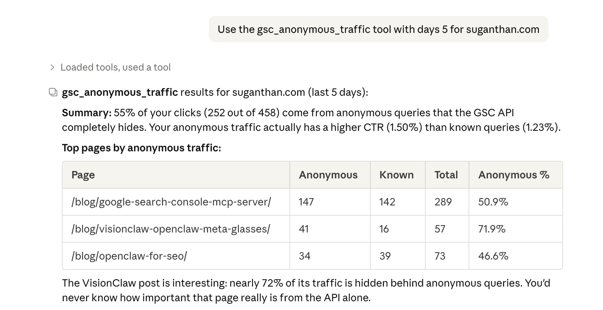
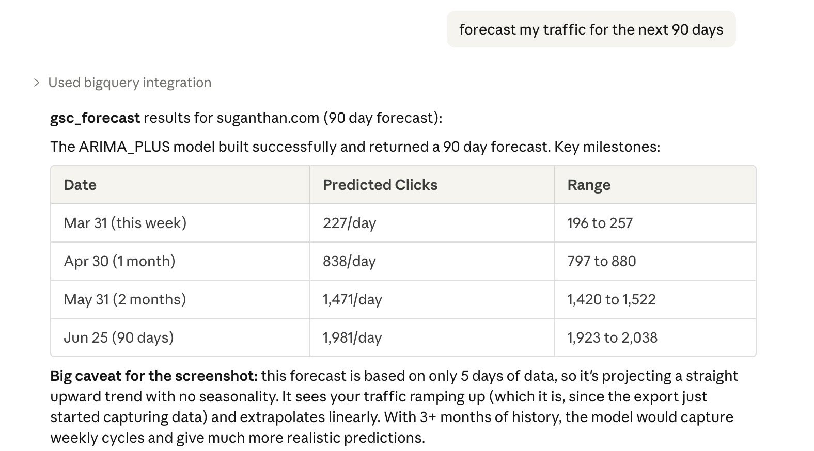
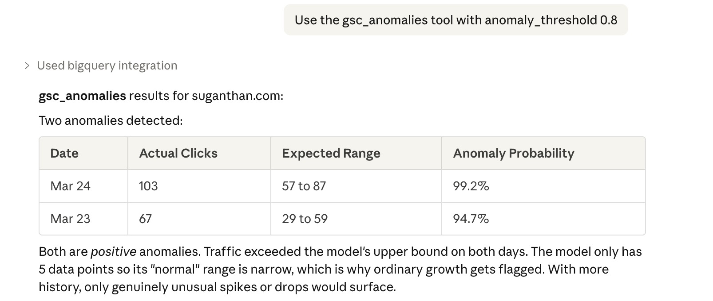
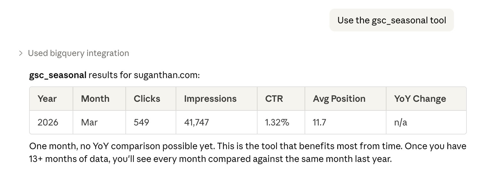
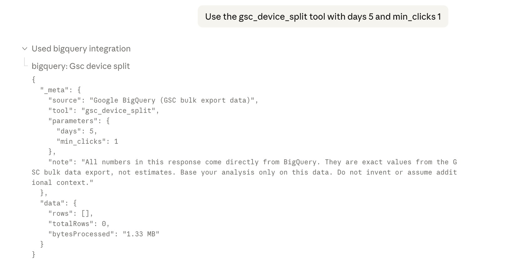
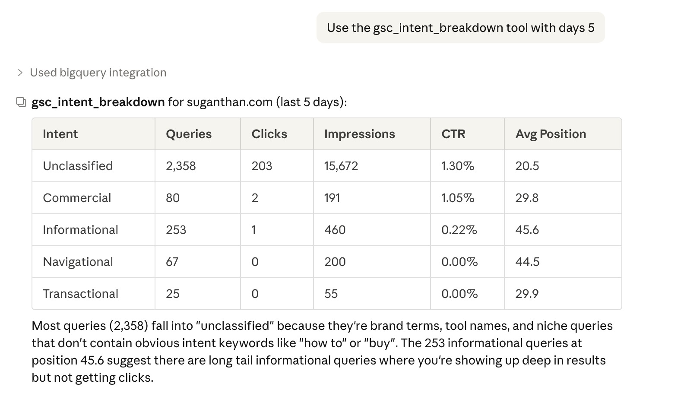
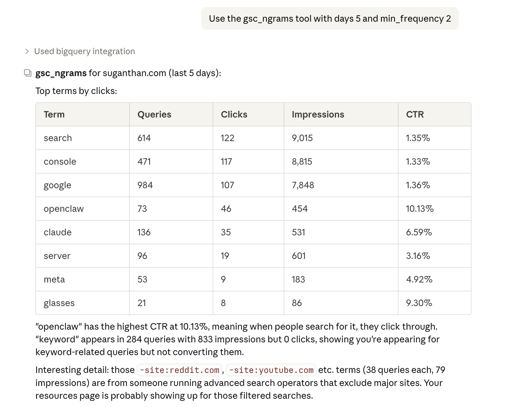
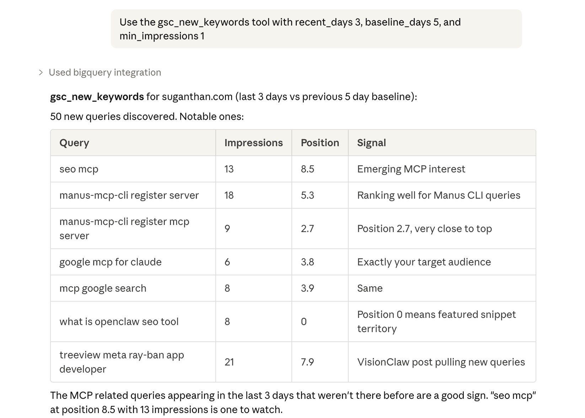
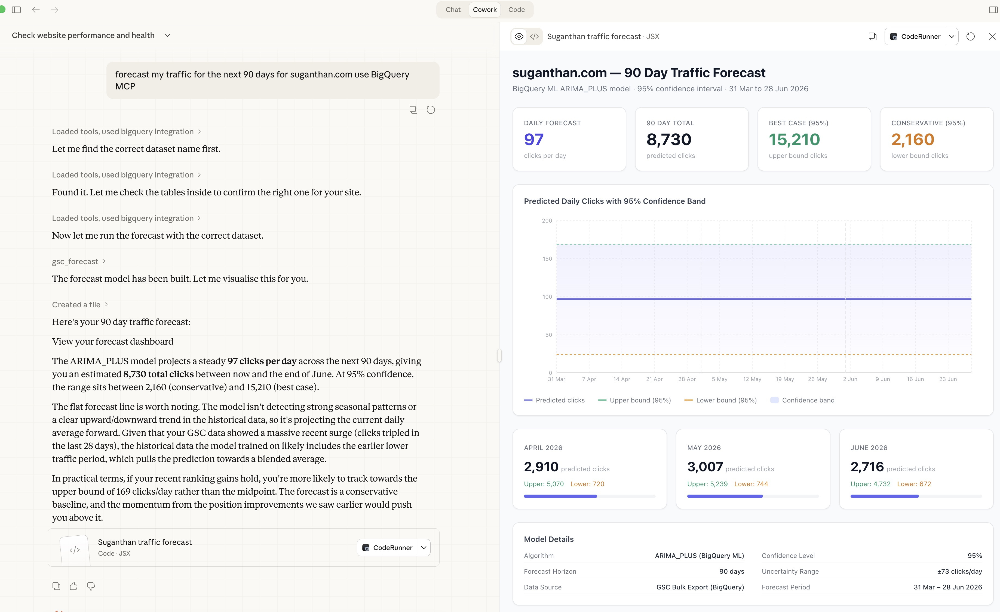

<p align="center">
  
</p>

# BigQuery MCP Server

An MCP server for BigQuery that lets you ask Claude questions about your search and analytics data warehouse and get real answers. Not raw query results. Actual analysis with verdicts and recommendations.

32 tools. GA4 + GSC revenue attribution. ML forecasting. Anomaly detection. Anonymous query analysis. Free and open source.

> **Full setup guide with screenshots:** [suganthan.com/blog/bigquery-mcp-server/](https://suganthan.com/blog/bigquery-mcp-server/)
>
> **New in v4.0 (GA4 integration):** [suganthan.com/blog/google-analytics-bigquery-mcp-server/](https://suganthan.com/blog/google-analytics-bigquery-mcp-server/)

## See it in action

**"How much of my traffic is hidden behind anonymous queries?"**



**"Forecast my traffic for the next 90 days"**



**"Are there any traffic anomalies I should investigate?"**



**"Show me year over year seasonal trends"**



**"Show me queries where mobile and desktop rank different pages"**



**"Break down my queries by search intent"**



**"What are the most common terms in my queries?"**



**"What new keywords appeared this week?"**



## What you can ask

```
What are my quick win keywords?
Which pages are losing traffic and why?
Forecast my traffic for the next 90 days
Are there any traffic anomalies I should investigate?
How much of my traffic comes from anonymous queries?
Show me year over year seasonal trends
What new keywords appeared this week?
Break down my queries by search intent
Show me queries where multiple pages are competing
Generate a full performance report
How does my CTR compare to benchmarks?
How is my /blog/ cluster performing?
Check for any SEO alerts in the last 7 days
Give me content recommendations
```

With the GA4 BigQuery export also connected (v4.0+):

```
Which keywords generate the most revenue?
Which pages have the biggest gap between rankings and conversions?
What is each search position worth on my site?
Which pages have a mismatch between their search snippet and actual content quality?
Compare branded vs non-branded performance for 'my brand, my-brand'
Show me page performance combining search and analytics data
```

## Quick start

```bash
git clone https://github.com/Suganthan-Mohanadasan/Suganthans-BigQuery-MCP-Server.git
cd Suganthans-BigQuery-MCP-Server
npm install
npm run build
```

Add to your Claude Desktop config (`~/Library/Application Support/Claude/claude_desktop_config.json`):

```json
{
  "mcpServers": {
    "bigquery": {
      "command": "node",
      "args": ["/path/to/Suganthans-BigQuery-MCP-Server/dist/index.js"],
      "env": {
        "BIGQUERY_PROJECT_ID": "your-project-id",
        "BIGQUERY_KEY_FILE": "/path/to/service-account-key.json",
        "BIGQUERY_DEFAULT_DATASET": "searchconsole",
        "BIGQUERY_LOCATION": "US"
      }
    }
  }
}
```

Your service account needs three IAM roles: **BigQuery Data Editor**, **BigQuery Data Viewer**, and **BigQuery Job User**.

> **Need help with BigQuery setup, bulk export, service accounts, or permissions?** The [full guide](https://suganthan.com/blog/bigquery-mcp-server/) walks through every step with screenshots.
>
> **Want the GA4 + GSC blending tools too?** Add the GA4 BigQuery export and one extra environment variable (`BIGQUERY_GA4_DATASET`). Full walkthrough: [GA4 + GSC in BigQuery setup guide](https://suganthan.com/blog/google-analytics-bigquery-mcp-server/).

## All 32 tools

### BigQuery exclusive (8)

These use BigQuery capabilities the Search Console API simply doesn't have.

| Tool | What it answers |
|---|---|
| `gsc_anonymous_traffic` | How much traffic is hidden behind anonymous queries? The API hides ~46% of clicks entirely. |
| `gsc_forecast` | ARIMA_PLUS traffic forecasting via BigQuery ML. Predict clicks up to 365 days out. |
| `gsc_anomalies` | ML anomaly detection. Flags genuinely unusual traffic patterns, not just threshold breaches. |
| `gsc_seasonal` | Year over year monthly comparison. Spot seasonal patterns with YoY percentage changes. |
| `gsc_device_split` | Queries where mobile and desktop rank entirely different pages from your site. |
| `gsc_intent_breakdown` | Classify all queries by search intent: informational, transactional, commercial, navigational. |
| `gsc_ngrams` | Extract recurring terms from queries. Find themes your content should cover. |
| `gsc_new_keywords` | Queries appearing in recent data that weren't present before. |

### GSC analysis (12)

The same analysis tools from the [GSC MCP server](https://github.com/Suganthan-Mohanadasan/Suganthans-GSC-MCP), rebuilt to run on BigQuery's unsampled data.

| Tool | What it answers |
|---|---|
| `gsc_quick_wins` | Keywords at positions 4 to 15 with high impressions, scored by opportunity |
| `gsc_ctr_opportunities` | Pages with high impressions but CTR below expected for their position |
| `gsc_content_gaps` | Topics with search demand but no real content targeting them |
| `gsc_site_snapshot` | How is the site doing overall? Clicks, impressions, CTR, position with period comparison |
| `gsc_content_decay` | Pages declining across three consecutive 30 day periods |
| `gsc_cannibalisation` | Keywords where multiple pages compete against each other |
| `gsc_traffic_drops` | What lost traffic, and whether it's a ranking loss, CTR collapse, or demand decline |
| `gsc_topic_cluster` | Aggregated performance for all pages matching a URL path pattern |
| `gsc_ctr_benchmark` | Your actual CTR per position vs industry benchmarks |
| `gsc_alerts` | Position drops, CTR collapses, click losses, disappeared pages. Severity rated |
| `gsc_content_recommendations` | Prioritised actions: pages to update, content to create, pages to consolidate |
| `gsc_report` | Full markdown performance report |

### GA4 + GSC blending (6, new in v4.0)

Require the GA4 BigQuery export running alongside GSC in the same project. Set `BIGQUERY_GA4_DATASET` (or pass `ga4_dataset` per call). [Full setup guide](https://suganthan.com/blog/google-analytics-bigquery-mcp-server/).

| Tool | What it answers |
|---|---|
| `ga4_gsc_query_revenue` | Which search queries actually drive revenue and conversions? Proportional attribution by click share. |
| `ga4_gsc_content_roi` | Which pages have the biggest gap between rankings and conversions? Diagnoses each page. |
| `ga4_gsc_position_value` | What is each search position worth on your site? Conversion rate and revenue per click by position bucket. |
| `ga4_gsc_snippet_mismatch` | Which pages have misleading or underselling snippets? |
| `ga4_gsc_branded_performance` | How does branded vs non-branded traffic convert? |
| `ga4_gsc_page_performance` | Full page-level search + analytics metrics joined per landing page. |

### General purpose (6)

Work with any BigQuery dataset, not just GSC.

| Tool | What it does |
|---|---|
| `query` | Run any SELECT query. Claude writes the SQL for you. |
| `query_cost_estimate` | Dry run to see bytes scanned before executing. |
| `list_datasets` | Discover available datasets in your project. |
| `list_tables` | All tables and schemas in a dataset. |
| `describe_table` | Column types, row counts, partitioning, size. |
| `sample_rows` | Preview rows without writing SQL. |

## Why BigQuery instead of the GSC API?

| | GSC API | BigQuery bulk export |
|---|---------|---------------------|
| Sampling | Sampled at high volumes | Unsampled |
| Anonymous queries | Hidden entirely | Included |
| History | Rolling 16 months | Permanent (forward only, no backfill) |
| Query flexibility | Fixed parameters | Any SQL you want |
| ML capabilities | None | ARIMA forecasting, anomaly detection |
| Cost | Free | ~$12 to $24/year |

Both complement each other. Use the [GSC MCP server](https://github.com/Suganthan-Mohanadasan/Suganthans-GSC-MCP) for quick real time lookups. Use this for deeper analysis.

## What makes this different

**Analysis, not just queries.** Most BigQuery tools give you raw SQL access. This ships with 26 pre-built SEO analysis tools: opportunity scoring, cannibalisation detection, decay tracking, CTR benchmarking, traffic drop diagnosis, ML forecasting, and GA4 + GSC revenue attribution. You ask a question, it runs the analysis and tells you what to do.

**ML built in.** ARIMA_PLUS traffic forecasting and anomaly detection run directly in BigQuery. No external services, no extra cost beyond standard BigQuery pricing.

**Hallucination guardrails.** Every tool instructs Claude to base analysis only on returned data. Provenance metadata in every response. Exact numbers, no speculation, insufficient data flagged.

**Visual dashboards.** Results render as rich, interactive visualisations in Claude Desktop. Summary cards, colour coded indicators, bar charts, and tabbed sections. Not plain text dumps.

**Read only. Cost controlled.** Only SELECT queries allowed. All mutations blocked. Auto-LIMIT on queries, 10GB bytes billed cap, dry run cost preview. EXPORT, CALL, and EXECUTE statements blocked.

## Environment variables

| Variable | Required | Description |
|---|---|---|
| `BIGQUERY_PROJECT_ID` | Yes | Your Google Cloud project ID |
| `BIGQUERY_KEY_FILE` | No | Path to service account JSON key (falls back to `GOOGLE_APPLICATION_CREDENTIALS`) |
| `BIGQUERY_DEFAULT_DATASET` | No | Default dataset for queries (e.g. `searchconsole`) |
| `BIGQUERY_LOCATION` | No | Dataset location (default: `US`). Set to `EU`, `asia-southeast1`, etc. if needed. |
| `BIGQUERY_GA4_DATASET` | No | GA4 export dataset name (e.g. `analytics_123456789`). Only needed for the 6 `ga4_gsc_*` blending tools. |

## Full guide

Step by step setup with screenshots, cost breakdowns, and honest comparison with dedicated SEO tools:

**[suganthan.com/blog/bigquery-mcp-server/](https://suganthan.com/blog/bigquery-mcp-server/)**

## Changelog

**v4.0.0** GA4 integration. 6 new tools that blend GA4 conversion and revenue data with GSC search data: `ga4_gsc_query_revenue`, `ga4_gsc_content_roi`, `ga4_gsc_position_value`, `ga4_gsc_snippet_mismatch`, `ga4_gsc_branded_performance`, and `ga4_gsc_page_performance`. Requires the GA4 BigQuery export running alongside GSC and one extra environment variable (`BIGQUERY_GA4_DATASET`). Total tools now 32. Full setup guide: [GA4 + GSC in BigQuery](https://suganthan.com/blog/google-analytics-bigquery-mcp-server/).

**v3.1.0** Visual dashboard rendering. All GSC analysis tools now produce rich, interactive visualisations in Claude Desktop with summary cards, colour coded indicators, bar charts, and tabbed sections instead of plain text output. No reinstall needed, just restart Claude Desktop.



**v3.0.0** Initial release with 26 tools: 8 BigQuery exclusives (anonymous traffic, ML forecasting, anomaly detection, seasonal analysis, device split, intent breakdown, N-grams, new keywords), 12 GSC analysis tools, and 6 general purpose BigQuery tools.

## Licence

Apache 2.0. See [LICENSE](LICENSE) and [NOTICE](NOTICE) for details. Use it, fork it, build on it. Just keep the attribution.

Built by [Suganthan Mohanadasan](https://suganthan.com). If you find it useful, star it.
